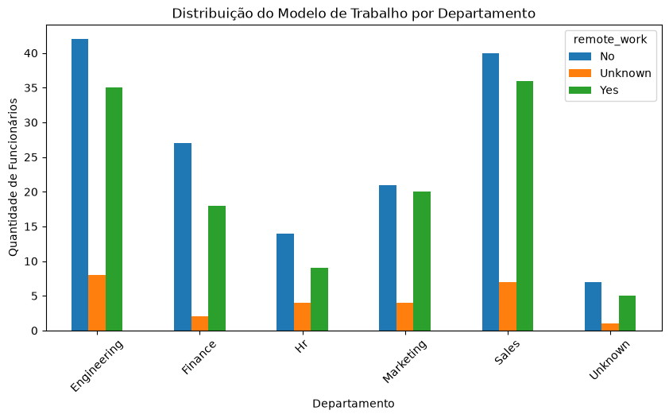

# Análise de Dados: Base de Funcionários (People Analytics)

## Sobre o Projeto
Este projeto foi desenvolvido com o objetivo de praticar e aplicar conceitos fundamentais de Análise de Dados usando Python, com foco principal nas bibliotecas **Pandas** e **Matplotlib**. 

Em vez de buscar responder a uma hipótese pré-definida, a proposta foi explorar a base de dados de forma investigativa para compreender a estrutura organizacional da empresa, identificar padrões de compensação e avaliar o impacto do modelo de trabalho no desempenho dos colaboradores.

---

## Limpeza e Tratamento de Dados (Data Cleaning)
A base original continha inconsistências e valores ausentes que foram identificados e corrigidos através do seguinte pipeline:

1. **Exploração Inicial:** Utilização de `.info()` e `.describe()` para mapear tipos de dados, duplicatas e volume de nulos.
2. **Remoção de Duplicatas:** Eliminação de 8 registros duplicados, reduzindo a base de 308 para 300 colaboradores únicos.
3. **Padronização Categórica:** Unificação de valores em caixas diferentes (ex: `Yes`/`yes`, `MARKETING`/`Marketing`) nas colunas `department` e `remote_work` utilizando `.str.title()`.
4. **Tratamento de Nulos:** Preenchimento de valores ausentes em `department` e `remote_work` com a categoria `'Unknown'`.
5. **Conversão de Tipos:** Formatação da coluna `join_date` para o tipo `datetime`.

---

## Perguntas Respondidas e Insights

### 1. Análise Salarial por Departamento
> **Qual departamento tem a maior média e mediana salarial? Existe grande variação dentro de uma mesma área?**

- **Maior Média:** O departamento de **Recursos Humanos (HR)** registrou a maior média de salários (~U$ 61.637,93).
- **Maior Mediana:** O setor de **Finanças** obteve a maior mediana (~U$ 61.928,91), demonstrando uma distribuição salarial mais equilibrada.
- **Maior Discrepância:** O setor de **Engenharia** apresentou a maior amplitude salarial, variando de U$ 22.786,04 a mais de **U$ 115.419,85** (o maior salário da empresa). Essa presença de *outliers* na liderança ou especialista sênior eleva a média do setor.

---

### 2. Remunerando o Modelo de Trabalho: Remoto vs. Presencial
> **Quem trabalha remoto ganha mais ou menos do que quem está no presencial?**

- **Média Salarial:** Colaboradores no modelo remoto possuem uma média salarial ligeiramente superior (**U$ 60.368,61**) em relação ao presencial (**U$ 59.093,89**).
- **Tetos Salariais:** O maior salário da empresa (U$ 115,4k em Engenharia) atua de forma remota, enquanto o teto do modelo presencial limita-se a U$ 98.590,99.

---

### 3. Desempenho x Modelo de Trabalho
> **O modelo de trabalho influencia a avaliação de performance dos funcionários?**

- **Mediana:** Ambas as modalidades mantiveram a mesma mediana na avaliação de desempenho (**4.0 / 5.0**), demonstrando estabilidade geral nas entregas.
- **Média de Desempenho:** Na média, o modelo remoto obteve uma nota de **3.78**, enquanto o presencial registrou **3.49** (uma diferença positiva de **+0.29 a +0.33 pontos** a favor do trabalho remoto).

---

### 4. Distribuição do Modelo de Trabalho por Setor

---

## Conclusão & Recomendações Estratégicas

A análise exploratória permitiu extrair três conclusões principais sobre a dinâmica organizacional da empresa:

1. **Adesão Eficiente ao Trabalho Remoto:** Os dados desmistificam a ideia de que o trabalho remoto prejudica a produtividade. Colaboradores remotos não apenas mantiveram a estabilidade de desempenho, como obtiveram uma média de avaliação superior (+0.33 pontos) à do modelo presencial.
2. **Atratividade e Retenção de Talentos:** A presença de cargos seniores com os maiores salários no modelo remoto sugere que a flexibilidade de trabalho pode estar sendo utilizada como um benefício estratégico para atração e retenção de profissionais altamente especializados (especialmente em Engenharia).
3. **Qualidade dos Dados (Data Quality):** A presença de cadastros incompletos (departamentos e modalidade não informados) destaca a necessidade de alinhar os processos de entrada de dados no sistema de RH para futuras análises mais precisas.

---

## Tecnologias e Bibliotecas Utilizadas
- **Python 3.14.7**
- **Pandas:** Limpeza, transformação e manipulação de dados.
- **Matplotlib / Seaborn:** Criação de visualizações de dados.
- **Jupyter Notebook:** Ambiente de desenvolvimento da análise.
